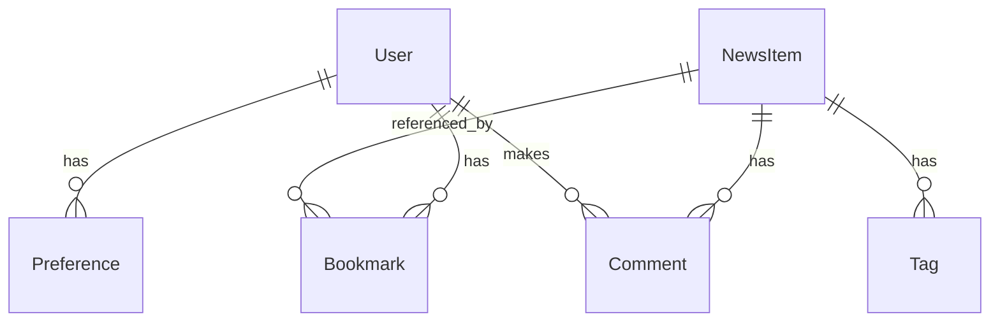
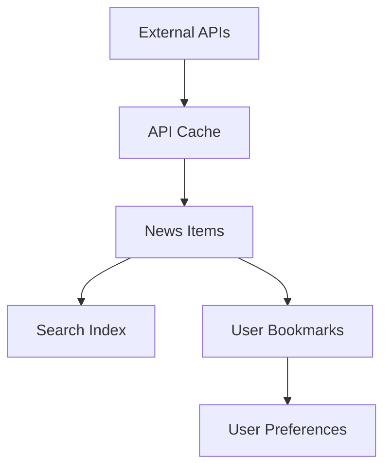

# Database Design

## Overview

This document outlines the database design for the HackerHome application, including data models, schemas, relationships, and caching strategies.

## Data Models

### News Items

#### Schema
```typescript
interface NewsItem {
  id: string;              // Unique identifier
  title: string;          // Article title
  url: string;            // Original article URL
  source: string;         // News source identifier
  points: number;         // Engagement points
  comments: number;       // Comment count
  timestamp: string;      // ISO timestamp
  author: string;         // Author name
  tags: string[];         // Article tags
  content?: string;       // Full article content
  metadata: {
    readTime: number;     // Estimated read time
    domain: string;       // Source domain
    language: string;     // Content language
  };
}
```

#### Indexes
```javascript
{
  "id": "unique",
  "url": "unique",
  "source_timestamp": "compound",
  "points_timestamp": "compound",
  "tags": "array"
}
```

### User Data

#### Schema
```typescript
interface User {
  id: string;              // Unique identifier
  email: string;          // User email
  preferences: {
    sources: string[];    // Preferred news sources
    tags: string[];       // Interested topics
    theme: 'light' | 'dark';
    notifications: boolean;
  };
  bookmarks: {
    id: string;          // Bookmark ID
    itemId: string;      // Referenced news item
    timestamp: string;   // When bookmarked
    collections: string[]; // User-defined collections
  }[];
  activity: {
    lastLogin: string;   // Last login timestamp
    lastRead: string[];  // Recently read items
    searches: string[];  // Recent searches
  };
}
```

#### Indexes
```javascript
{
  "id": "unique",
  "email": "unique",
  "bookmarks.itemId": "array"
}
```

### Search Data

#### Schema
```typescript
interface SearchIndex {
  id: string;              // Document ID
  type: 'article' | 'repository';
  title: string;          // Searchable title
  content: string;        // Searchable content
  tags: string[];         // Associated tags
  metadata: {
    source: string;       // Content source
    timestamp: string;    // Indexing time
    language: string;     // Content language
  };
  vector: number[];       // Search vector
}
```

#### Indexes
```javascript
{
  "id": "unique",
  "type_timestamp": "compound",
  "tags": "array",
  "vector": "vector"
}
```

## Cache Structure

### API Cache

#### Schema
```typescript
interface CacheEntry {
  key: string;            // Cache key
  data: any;             // Cached data
  timestamp: string;      // Cache time
  expires: string;        // Expiration time
  tags: string[];        // Cache tags
}
```

#### Indexes
```javascript
{
  "key": "unique",
  "expires": "ttl",
  "tags": "array"
}
```

### User Session

#### Schema
```typescript
interface Session {
  id: string;            // Session ID
  userId: string;        // User reference
  token: string;         // JWT token
  created: string;       // Creation time
  expires: string;       // Expiration time
  metadata: {
    ip: string;         // IP address
    userAgent: string;  // Browser info
    device: string;     // Device info
  };
}
```

#### Indexes
```javascript
{
  "id": "unique",
  "userId": "index",
  "token": "unique",
  "expires": "ttl"
}
```

## Data Relationships

### Entity Relationships


### Data Flow


## Caching Strategy

### Cache Layers

#### Browser Cache
```typescript
interface BrowserCache {
  newsItems: Map<string, NewsItem>;
  userPreferences: UserPreferences;
  searchResults: Map<string, SearchResult[]>;
}
```

#### API Cache
```typescript
interface ApiCache {
  requests: Map<string, CachedResponse>;
  aggregations: Map<string, AggregatedData>;
  userSessions: Map<string, Session>;
}
```

#### Database Cache
```typescript
interface DbCache {
  queries: Map<string, QueryResult>;
  counts: Map<string, number>;
  popular: Map<string, NewsItem[]>;
}
```

## Query Patterns

### Common Queries

#### Get Recent News
```typescript
interface NewsQuery {
  source?: string[];
  page?: number;
  limit?: number;
  sort?: 'latest' | 'popular';
}
```

#### Search Content
```typescript
interface SearchQuery {
  query: string;
  filters?: {
    source?: string[];
    date?: DateRange;
    type?: string[];
  };
}
```

### Aggregations

#### Popular Items
```typescript
interface PopularItems {
  timeframe: '1h' | '24h' | '7d';
  source?: string[];
  limit?: number;
}
```

#### Tag Trends
```typescript
interface TagTrends {
  period: string;
  minCount: number;
  limit?: number;
}
```

## Performance Considerations

### Indexing Strategy
- Compound indexes for common queries
- Text indexes for search
- TTL indexes for cache
- Array indexes for tags

### Query Optimization
- Limit result sets
- Use projections
- Batch operations
- Cursor pagination

### Caching Rules
- Cache frequently accessed data
- Implement cache invalidation
- Use cache tags
- Handle cache misses

## Data Migration

### Migration Strategy
```typescript
interface Migration {
  version: string;
  up: () => Promise<void>;
  down: () => Promise<void>;
  description: string;
}
```

### Backup Strategy
```typescript
interface Backup {
  frequency: 'daily' | 'weekly';
  retention: number;
  type: 'full' | 'incremental';
}
```

## Security

### Data Protection
- Encryption at rest
- Secure connections
- Access controls
- Data sanitization

### Access Patterns
- Role-based access
- Field-level security
- Query restrictions
- Rate limiting

## Monitoring

### Metrics
- Query performance
- Cache hit rates
- Storage usage
- Error rates

### Alerts
- Slow queries
- High load
- Error spikes
- Storage limits 